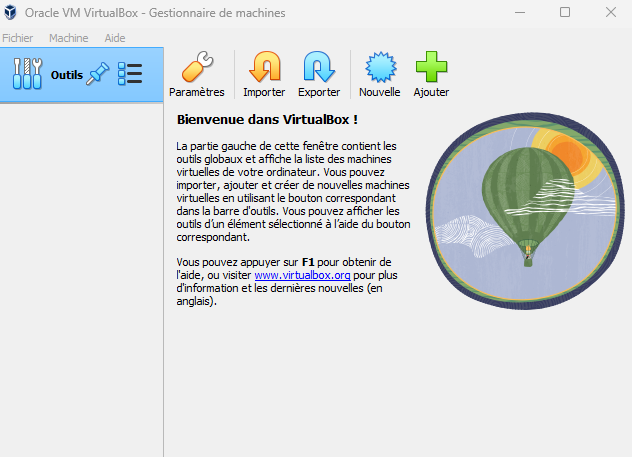
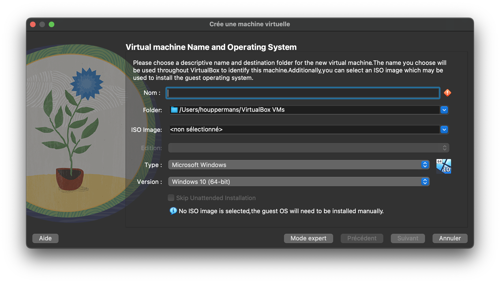
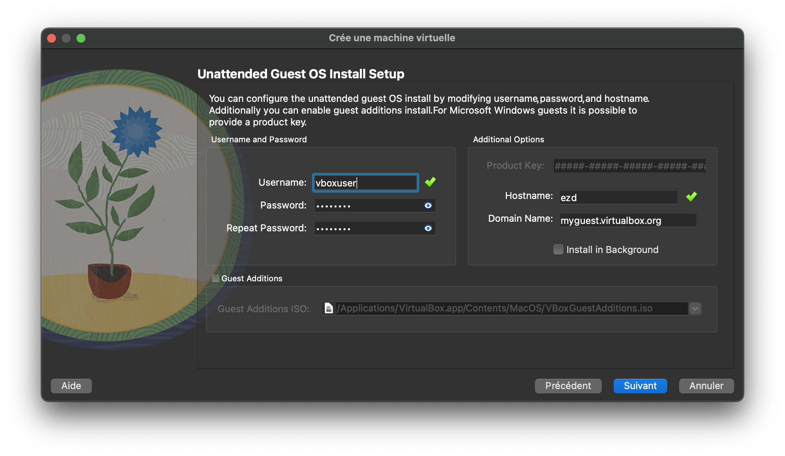
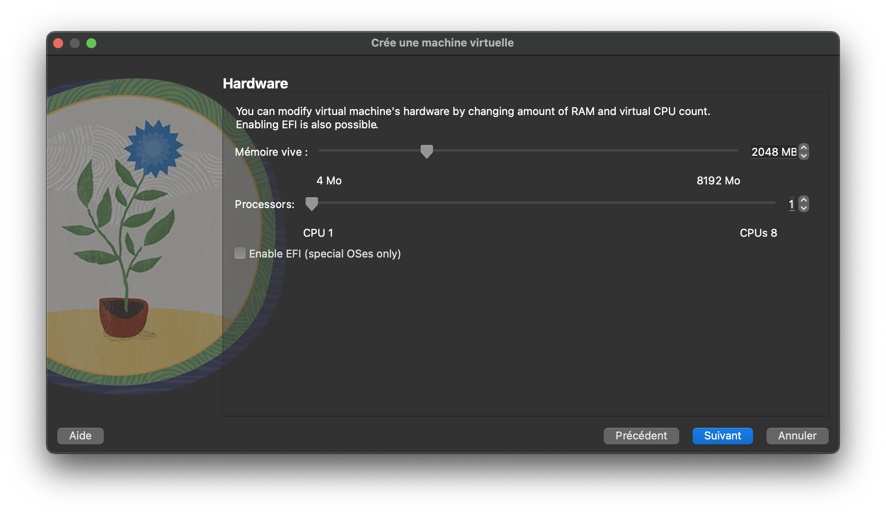
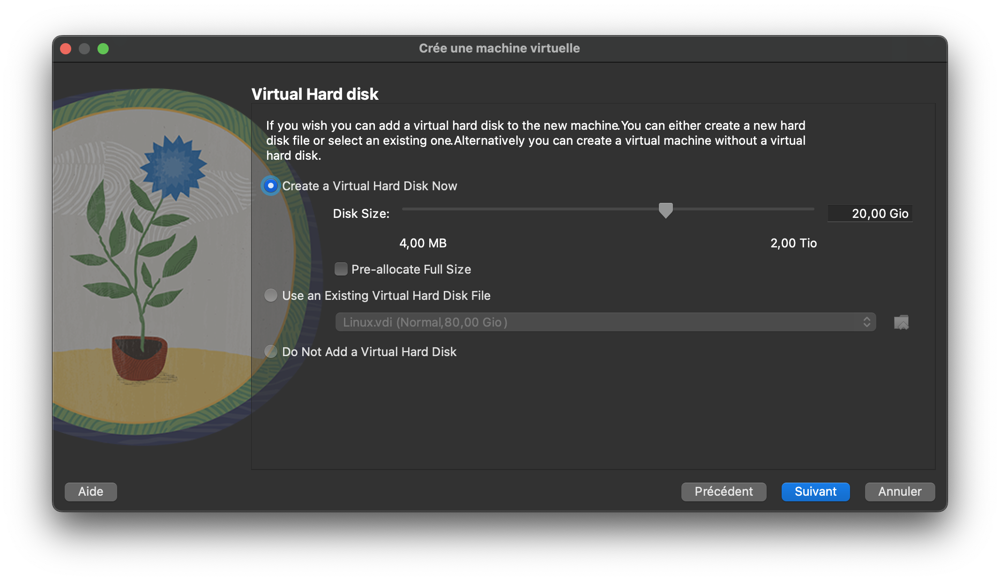
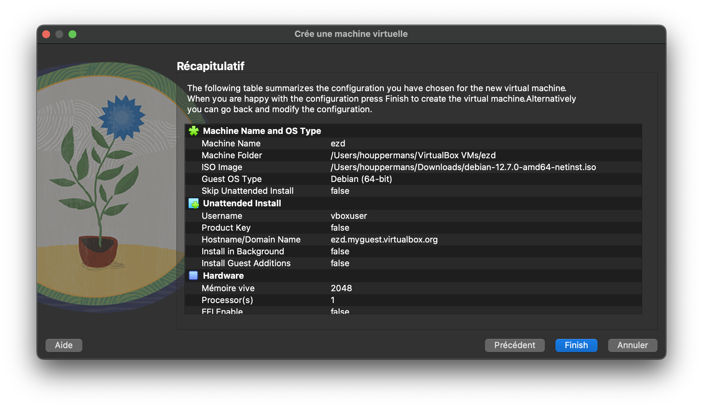
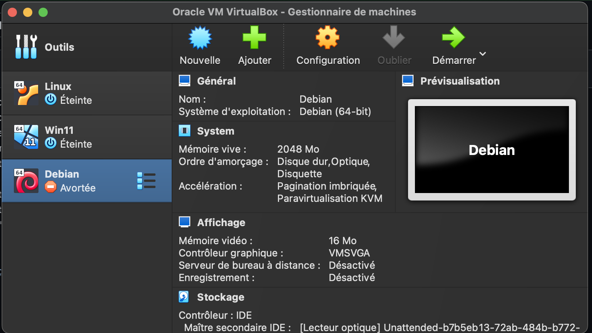

1- Installer VBox  
2- Installer iso de l'os que vous voulez  
3- Ouvrir VBox et aller dans "Nouveaux" 

4- Donnez un nom a votre machine  
5- Installer votre iso la ou il vous le demande  

6- Donner votre username et MDP que vous voulez istaller sur votre MV  

7- Choisisez notre nombre de RAM alouez et le nombre de CPU  

8- Indiquer la taille de votre disque dur virtuel  

9- Cliquer sur "Finish"  

10- Vous pouvez lancer votre VM

